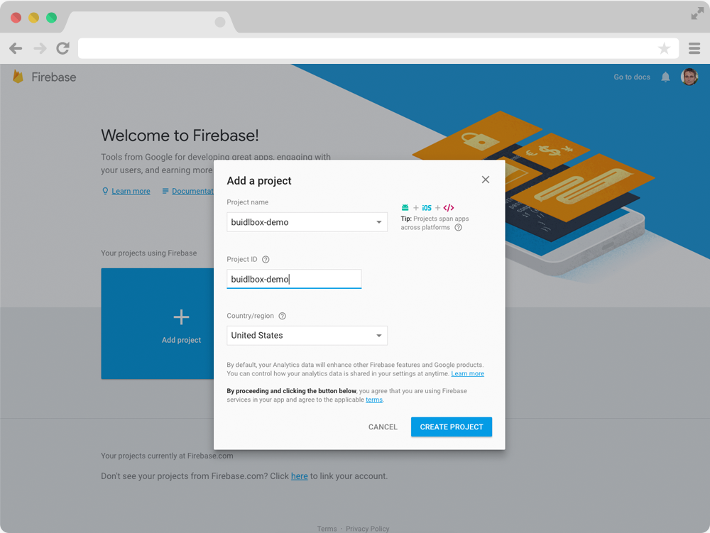
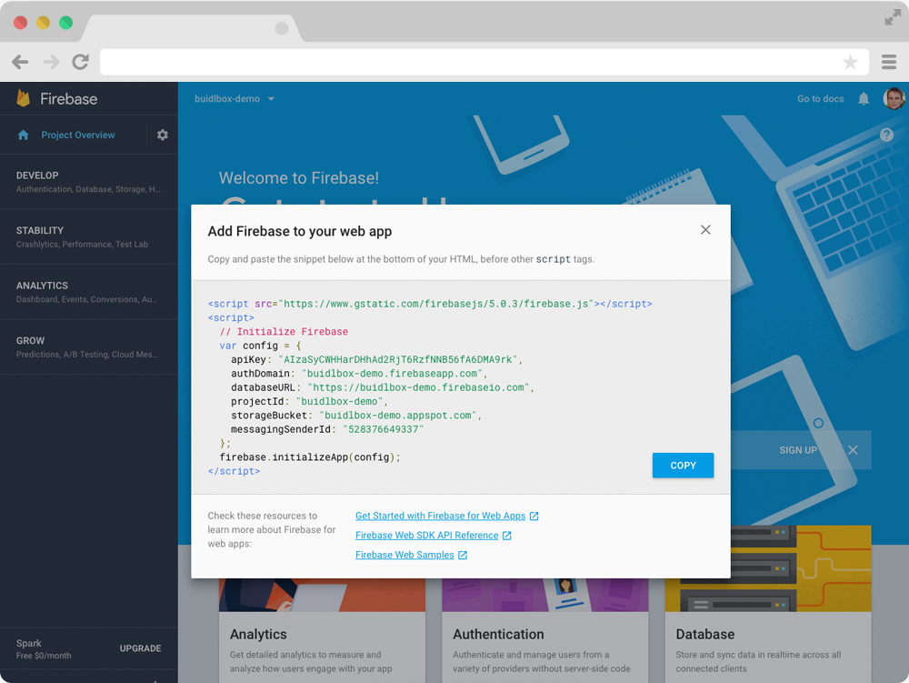
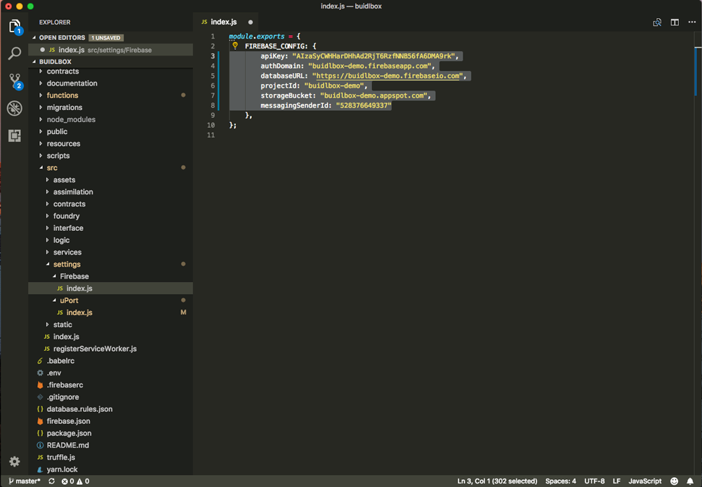

# User Dashboard w/ Attestation Request Example

A uPort demo application example, demonstrating private server login and attestation requests using the `pushToken` feature.

### Install

```
-------- Step 1 --------
git clone git@github.com:uport-project/example-user-dashboard.git ; cd example-user-dashboard

-------- Step 2 --------
npm install || yarn

-------- Step 3 --------
npm run start || yarn start => development
npm run build || yarn build => production

--- Developer Tools ---
$ npm install -g truffle
```

## Initial Configuration Setup

1. Setup new Firebase Project and change `.firebasrc` file to change default project.
2. Change the environment variable `REACT_APP_FIREBASE_PROJECT_ID` in the .env file to match the Firebase Project name/alias.
3. Register a decentralized using uPort AppManager (https://appmanager.uport.me/) and save address and private key.
3. Set environment environment variables with new applicatio information.
5. Setup custom authentication server (Firebase => Project Settings => Service accounts ) and save private keys in newly created `secrets` folder in the `src/functions` and name the file `service_accounts.json` - this information gets include in cloud function deploy for custom auth server.
5. Compile Firebase Cloud Functions and deploy `yarn build ; firebase deploy --only functions`

#### Example of configuring environment variables
```
firebase functions:config:set uport.appname=APPNAME uport.simplesigner=SIMPLESIGNER uport.address=ADDRESS
```

### Merging Web 2.0 and Web 3.0
The BuidlBox is designed to merge Web 2.0 and Web 3.0 capabilities.

For the time being, decentralized solutions haven't reached full maturity, which means we still have to rely on traditional  methods of building applications. However, moving forward the BuidlBox will start to migrate as many features as possible to the decentralized web i.e. file storage on IPFS, membership payments using ChronoLogic, distributed computing using WebAssembly, and more.


#### Firebase - The Web 2.0 Platform
The BuidlBox includes a Firebase backend to simplify deployment of Web 2.0 and Web 3.0 application requiring authentication, hosting, database (JSON and NoSQl), and serverless infrastructure (Cloud Functions). You might be asking "Why pick Google servers to build decentralized applications?", which is a great question! And the answer is "Convenience." For the time being it's more important developers can easily experiment with emerging solutions using production ready platforms. Once we're ready to make the switch from centralized services to decentralized services, the BuidlBox will change it's architecture to match those requirements.
 
### Start A New Project
1. Register a Web 3.0 decentralized application on uPort
2. Create a new Web 2.0 project on Firebase.

#### uPort Application Manager
https://appmanager.uport.me

The AppManager provides an easy-to-use interface for developers to quickly register decentralized applications on the Ethereum Blockchain.

The AppManager helps developers generate  new keypairs, upload application information to IPFS and register the application on the Ethereum blockchain in just a few simple steps. Scan a QR code. Sign a transaction request. Done.

- Login to AppManager
- Create New Application
- Edit Application Details
- Save Decentralized Application
- Add SimpleSigner Private Key to Backend Services

The uPort AppManager makes registering a new decentralized application on the blockchain quick and easy. uPort helps hide away the complexities of interacting with decentralized solutions like Ethereum and IPFS, so developers can focus on application features and not blockchain scaling solutions.

Firebase Project
https://firebase.google.com


#### Create A New Project
The Firebase platform makes it easy to launch new Web 2.0 applications. Simply create a new project and the neccesary infrastructure will be initialized.



#### Copy/Paste Project Configuration



#### Connect Firebase and BuidlBox Frontend 
After a new Firebase project has been initialized it's time to copy/paste the project configuration files into the BuidlBox settings.

The default BuidlBox settings are located in `/src/settings/Firebase/index.js` which should be replaced with the newly minted configuration parameters



### Custom Authentication Server
uPort allows users (self-sovereign identities) to authenticate themselves with Web 2.0 applications using the Ethereum Blockchain. However,to take advantage of these capabilities a custom authentication server is required. Fortunately, the BuidlBox contains an `identity` Cloud Function, which includes Firebase and uPort Authentication services, so developers can quickly setup an authentication service, so uPort Identities can login to a web application.

The `identity` Cloud Function is located in `functions/src/index.js` and is being exported via `exports.identity` object. When the Firebase Cloud Functions are deployed an HTTPS endpoint is created, which is accessed using the `UPortLoginFirebase` component located in `src/assimilation/containers/uport` folder.

#### Authentication Server Snippet
To properly authenticate a self-sovereign identity the `uportCredentials.receive()` must be called in the same function generating the browser<=>server authentication token.

```
exports.identity = functions.https.onRequest((request,response)=> {
  cors(request, response, () => {
    const JWT = request.body.JWT
    uportCredentials.receive(JWT)
    .then(profile => {
      if (profile.name) {
        admin.auth().updateUser(profile.address, {
          displayName: profile.name
        })
      }
    ...
```

Warning: The current setup is meant to provide a simple demonstration. The current Cloud Function could be improved to include better security practices. In addition, defensive programming techniques, like IP adress throttling (Firebase throttles resource consumption in certain circumstances), could be introduced to limit the amount of computational resources a bad actor could consume.

##### A Quick Overview of How It Works
The `uportCredentials.receive()` is passed a `JWT` variable constant (also called an `access_token`) and if the `JWT` has been properly signed by a self-sovereign identity, the `uportCredentials.receive()` function will resolve the JWT token into the self-sovereign identity profile. Depending on what `credentials` and whether the `notifications` have been requested, the profile will contain varying information on request.

Below is an example of a profile, which has been succesfully authenticated.

```
{
'@context': 'http://schema.org',
  '@type': 'Person',
  publicKey: '0x047....',
  publicEncKey: 'xXCMn....',
  name: 'Kames',
  avatar: { uri: 'https://ipfs.infura.io/ipfs/QmQQkhCFRRGT2tADE4NmvPeX7VAgfGMSdewKdwcBfjGHu6' },
  country: 'New York',
  phone: '4158791469',
  email: 'info@kameacg.com',
  pushToken: 'eyJ0eXA....',
  address: '2oyqAfeJHyRgKuwpt7j2pMAE13nvmbSGUbW',
  networkAddress: '2oyqAfeJHyRgKuwpt7j2pMAE13nvmbSGUbW'
}
```

A persistent parameter returned in all self-sovereign identity request it the `address` parameter, which is actually the account MNID. In the future, the `address` parameter will probably be renamed

The identity profile contains an MNID - a unique identifier specific to the self-sovereign identity. The MNID is the persistent identifier,which can be used to authenticate a Person in any envirnonment.

The MNID is Unique Identifier not easily replicated (theoretically low probabilities of duplication), which is why it can be used to authenticate a self-sovereign identity. However, to reduce the risk of identity theft, it's critical the the `JWT` is authenticated in the same function responsible for creating the session token authenticating the browser and server session. Put simply, do not authenticate 

The MNID is passed to the Firebase 

`admin.auth().createCustomToken(profile.address)`

The MNID is Multi Network Identifier - an encoding scheme for Ethereum Addresses and Network Identifiers. 

For more information please refer to the MNID repo: https://github.com/uport-project/mnid


### Set Environment Variables
Each project requires setting envrionment variables i.e. AppName, Address and Private Key to privately issues attestations.

As a developer starting to experiment with decentralized solutions, like the Ethereum Blockchain, you're probably already familiar with cryptography and the use public/private key-pairs in server environments, whether that's validating yourself with a backend server using `ssh` or authenticating to `git` server to push new code.

```
firebase functions:config:set uport.appname=APPNAME uport.simplesigner=SIMPLESIGNER uport.address=ADDRESS
```

To limit exposure of the private keys (hardcoding) BuidlBox uses environment variables to minimize the exposure of sensitive information. Additionally, environment variables are used to minimize code changes when neccesary, like for example setting the application name, which doesn't require the same dudiligence as private key management, but is simply more convient.

The environment variables are passed to the Firebase Cloud Functions during runtime and function invocation (either directly via a HTTPS post request or by monitoring database paths.

Below the `firebase-functions` config method is called, creating a `configuration` object, which contains the required environment variables. The uPort `configuration` parameters are passed to the uPort `Credentials` class function, which creates an object capable of requesting login credentials and generating private attestations.

```
const functions = require('firebase-functions')
const configuration = functions.config()

// uPort
const uportAppName = configuration.uport.appname
const uportAppAddress = configuration.uport.address
const uportSimpleSignerKey = configuration.uport.simplesigner

const uportCredentials = new Credentials({
  appName: uportAppName,
  address: uportAppAddress,
  signer: uportSimpleSigner,
})
```


*Warning:* The SimpleSigner is the private key responsible for signing "attestation" requests. If you're planning on running a production application particpating in the *Web of Trust* please be very **careful** about the procedures for managing the private key. For the time being BuidlBox is under active development and should be considered beta - we recommend developers experiment with building applications that contributed to the Web of Trust. In other words, better private key management is still required before attestations can be issued with a high degree of confidence the "trust" won't be broken by a malicious actor compromising the private key.

#### Authentication 
A primary feature of uPort's Decentralized Identity is authentication using the Ethereum Blockchain.


## How To Get Involved
It's encouraged to format the BuidlBox issues adhering to our submission guidelines. A primary objective of the BuidlBox is to encourage collaboration and input from the uPort/Ethereum growing community. We want this to be your project. If you see an opportunity. Great! Create a public issue, uPort will fund the bounty and together we'll Open Source The World.

- User Story
- Background
- Acceptance Criteria
- Technical Details


### Project File Structure
The BuidlBox is a production ready boilerplate. During Beta the file structure is liable to change/simplify. However, you can always expect to be able to spin-up the BuidlBox and have a complete Site/Dashboard application ready-to-go. 
```
├── assembly - WebAssembly Files
├── contracts - Ethereum Smart Contracts
├── public
|  ├── favicon.ico
|  ├── index.html - Application Entry
|  ├── manifest.json - Progressive Web Application
├── functions - Firebase Cloud Functions
|  ├── benchmark - Tests
|  ├── secrets - Add Project Specific Secrets
|  ├── src - Cloud Functions
|  |  ├── authorization - HTTPS Authorization
|  |  ├── contracts - Ethereum Smart Contracts
|  |  ├── database - Firebase Database
|  |  ├── twitter - Twitter API Client
├── src
|  ├── assets - Media Assets (images, svg, etc...) 
|  ├── assimilation - Blockchain Redux-related
|  |  ├── components - Stateless Blockchain Components 
|  |  ├── containers - Stateful Blockchain Components
|  |  ├── store - Redux Store
|  |  |  ├── [department] - Single Blockchain Module
|  |  |  |  ├── tests - unit tests
|  |  |  |  ├── actions.js - Action creators / plain objects
|  |  |  |  ├── reducers.js - Pure functions / immutable.js
|  |  |  |  ├── sagas.js - Asynchronous side-effects
|  |  |  |  ├── selectors.js - State selectors / reselect.js
|  |  |  |  ├── types.js - Action types / string constants
|  |  |  |  └── utils.js - Module-specific helpers
|  |  |  └── actions.js - Actions combiner
|  |  |  └── actionsAuto.js - Streamlined Actions combiner
|  |  |  └── middlewares.js - Redux Middleware Combiner
|  |  |  └── sagas.js - Saga combiner
|  |  |  └── selectors.js - Saga combiner
|  |  |  └── utils.js - Redux Store Utilities
|  |  ├── libs - Framework-agnostic libraries
|  |  ├── utils - Common utility helper functions
|  |  ├── store.js - Redux reducer and middleware injector
|  ├── contracts - Ethereum Smart Contracts)
|  ├── interface - Primary Component Library 
|  |  ├── components - General Stateless Components 
|  |  ├── containers - General Stateful Components
|  |  ├── entity - Entity Components (Person, Organization, Project, etc...)
|  |  ├── features - Specific Stateless/Stateful Components
|  |  ├── foundry - Dialog/Portal Components  
|  |  ├── forms - Redux Form Components
|  |  ├── layout - Site/Dashboard Layout
|  |  ├── routes - Redux Routing
|  |  |  └── dashboard.js
|  |  |  └── index.js
|  |  |  └── site.js
|  |  ├── store - Default Redux Store
|  |  |  └── configuration
|  |  |  └── store
|  |  |  ├── [department] - Single Blockchain Module
|  |  |  |  ├── tests - Jest unit tests
|  |  |  |  ├── actions.js - Action creators / plain objects
|  |  |  |  ├── reducers.js - Pure functions / immutable.js
|  |  |  |  ├── sagas.js - Asynchronous side-effects
|  |  |  |  ├── selectors.js - State selectors / reselect.js
|  |  |  |  ├── types.js - Action types / string constants
|  |  |  |  └── utils.js - Module-specific helpers
|  |  ├── theme - Style Settings
|  |  |  └── inject - Add CSS from Third-Party Modules
|  |  |  └── settigns - Color, Gradients, Tex Shadow, etc...
|  |  |  └── stylesheet - CSS 
|  |  ├── views - Pages & Complex Componets
|  ├── logic - Utility Libraries and General Helpers
|  ├── services - Configuration with Services (Firebase)
|  └── index.js - Entry point for app
```